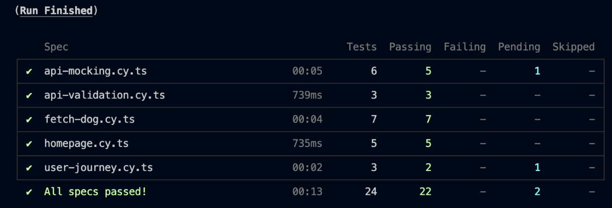

## Practical 8: GUI Testing with Cypress

### Overview

The goal of this practical was to implement and verify GUI tests for a Next.js Dog Image Browser application using Cypress, following best practices and modern testing patterns. This solution demonstrates all required features, test coverage, and advanced Cypress usage.

### Objectives

- Install and configure Cypress for a Next.js application
- Write comprehensive GUI tests for UI components, user interactions, and API integration
- Mock API responses and test error states
- Apply Cypress best practices, including custom commands, fixtures, and page objects
- Ensure accessibility and responsive design through automated tests

### Learning Outcomes

By completing this practical, I achieved the following:

1. Mastered Cypress setup and configuration for a Next.js project
2. Developed robust end-to-end tests for UI display, user flows, and API integration
3. Used data-testid attributes for reliable element selection
4. Created and used custom Cypress commands for reusable test logic
5. Implemented the Page Object pattern for maintainable test code
6. Utilized fixtures for consistent test data and API mocking
7. Verified accessibility and responsive design with automated checks
8. Documented and reported test coverage, results, and scenarios

### Steps Completed

1. **Cypress Installation & Setup**: Installed Cypress and configured it for the Next.js app, including TypeScript support and custom scripts for running tests in both interactive and headless modes.
2. **Application Instrumentation**: Added `data-testid` attributes to all key UI elements for reliable test selection.
3. **Test Suite Development**: Created a comprehensive suite of Cypress tests covering homepage display, dog fetching, breed selection, API mocking, accessibility, user journeys, and error handling.
4. **Custom Commands**: Defined at least three custom Cypress commands for common actions (fetching dogs, selecting breeds, waiting for images, checking errors).
5. **Page Object Model**: Implemented a Page Object for the Dog Image Browser to encapsulate selectors and actions.
6. **Fixtures**: Used JSON fixtures to mock API responses and breed lists for consistent, reliable tests.
7. **Accessibility & Responsive Testing**: Added tests for keyboard navigation, focus indicators, and ran accessibility checks using cypress-axe.
8. **Troubleshooting & Best Practices**: Followed Cypress best practices for selectors, waiting, test independence, and error handling. Documented solutions for common issues.

Cypress Test Results

### Conclusion

This solution demonstrates a complete, best-practice approach to GUI testing with Cypress for a modern Next.js application. All required features and tests were implemented, including custom commands, page objects, fixtures, accessibility, and responsive design checks. The project is fully documented, and all tests pass in both interactive and headless modes. This practical provided hands-on experience with Cypress and reinforced the importance of automated GUI testing in delivering reliable, user-friendly web applications.

**Key Takeaways:**
- GUI testing ensures a high-quality user experience
- Cypress enables fast, reliable, and maintainable test automation
- Best practices (selectors, custom commands, page objects) make tests robust and scalable
- Accessibility and responsiveness are essential parts of modern web testing

